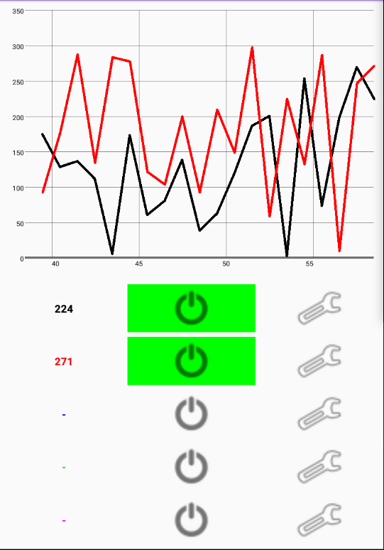
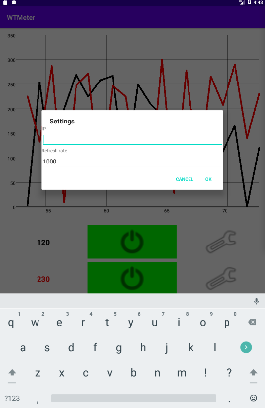

# WTMeter
This is the android application for my Wireless Temperature Meter project. The project aim is to create a simple, cheap and reliable wireless temperature sensor that can be easily used in the field to measure and compare the real time temperature at multiple locations/points at the same time. For example it could be used to measure the temperature of the entry and exit points of a cooling radiator.

## Application
The application collects the temperature information from different sensors and plot the data on a real time graph. Different refresh rates can be assigned to each sensor as well as the curve color.

App with mokeup sensor data:

Configuration menu:

Demo of complete project

